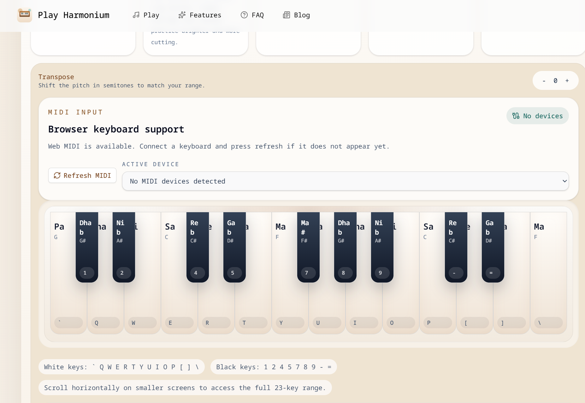

# PlayHarmonium

PlayHarmonium is a free web harmonium for browser-based practice. It gives learners a clean keyboard layout with touch controls, computer-key shortcuts, Sargam labels, transpose, and beginner-friendly guides without making them install anything first.

[PlayHarmonium](https://playharmonium.com/) | [Feature overview](https://playharmonium.com/#features)

## Why This Project Exists

Most people searching for an online harmonium want to start playing right away, not land on a generic marketing page. This project keeps the instrument front and center while still supporting tutorials, blog content, and future product expansion.

## What You Can Do

- Play a full browser harmonium without installing software
- Use touch controls, keyboard shortcuts, or Web MIDI input
- Switch between Sargam and western note labels
- Adjust octave, transpose, and volume for daily practice
- Open a focused keyboard page for distraction-free sessions
- Read beginner guides that explain notes, layout, and practice flow

## Product Pages

- Website: [https://playharmonium.com/](https://playharmonium.com/)
- Keyboard page: [https://playharmonium.com/keyboard](https://playharmonium.com/keyboard)
- Beginner guide: [https://playharmonium.com/blog/harmonium-keyboard-notes-for-beginners](https://playharmonium.com/blog/harmonium-keyboard-notes-for-beginners)
- Blog: [https://playharmonium.com/blog](https://playharmonium.com/blog)

## Tech Stack

- Next.js 16
- React 19
- TypeScript
- next-intl
- Drizzle ORM
- PostgreSQL
- Tailwind CSS

## Local Development

1. Install dependencies with `pnpm install`
2. Start PostgreSQL and set `DATABASE_URL`
3. Run `pnpm db:push`
4. Seed defaults with `pnpm rbac:init` and `pnpm config:init`
5. Start the app with `pnpm dev`

## Deployment

- Production domain: [playharmonium.com](https://playharmonium.com)
- GitHub repository: [bikai9289/Harmonium](https://github.com/bikai9289/Harmonium)
- Recommended hosting: Vercel

## Docs

Project planning, setup notes, and test logs live under `doc/` locally and are not committed to this repository.
